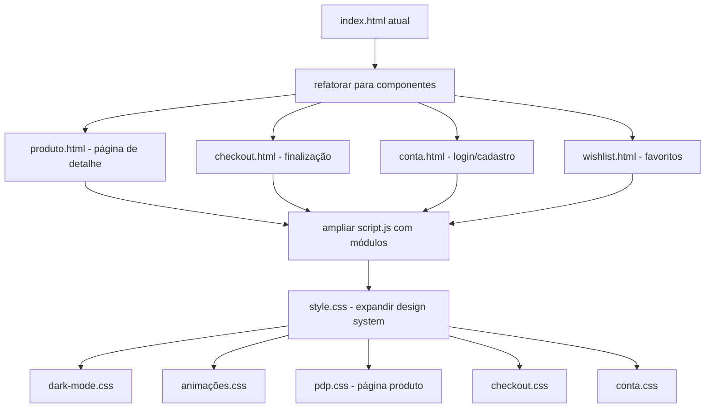

# 🧠 Plano de Melhorias — Essentia → Nível Premium (Zara, Balenciaga, Gucci)

## 📊 Análise Atual
O site Essentia já tem uma base sólida: design system coeso, carrinho funcional, filtros, carrossel, formulários, acessibilidade e responsividade. Para alcançar o nível de marcas premium internacionais, precisamos adicionar camadas de **sofisticação visual, funcionalidades de e-commerce completas e experiências imersivas**.

---

## 🚀 1. GALERIA DE IMAGENS DE PRODUTOS (ESSENCIAL)
| Item | Descrição |
|------|-----------|
| **Fotos reais** | Substituir placeholders por imagens reais de produtos |
| **Galeria com zoom** | Hover/magnifier na imagem do produto |
| **Múltiplos ângulos** | Carrossel de imagens (frente, costas, detalhes) |
| **Modelo vestindo** | Fotos em modelos reais para referência de caimento |

## 🛍️ 2. PÁGINA DE DETALHE DO PRODUTO (PDP)
- Rota individual para cada produto (`/produto/jaqueta-oversized`)
- **Seleção de tamanho** (PP, P, M, G, GG, 2G, 3G, 4G) com tabela de medidas interativa
- **Seleção de cor/variante** com swatches visuais
- **Avaliações e estrelas** dos clientes
- **Produtos relacionados** / "Complete o look"
- **Botão "Adicionar à sacola"** sticky no mobile
- **Descrição detalhada** com guia de cuidados e tecidos

## 🧾 3. CHECKOUT COMPLETO
- **Carrinho lateral** → Página de checkout dedicada
- **Etapas:** Sacola → Frete → Pagamento → Confirmação
- **Cálculo de frete** por CEP
- **Múltiplas opções de pagamento:** Pix, cartão (parcelado), boleto
- **Resumo do pedido** antes de finalizar

## 👤 4. CONTA DO USUÁRIO / MINHA CONTA
- **Cadastro / Login** (e-mail + senha, Google, Apple)
- **Meus Pedidos** — histórico com status (separação, envio, entrega)
- **Meu Endereço** — CRUD de endereços
- **Meus Favoritos / Wishlist** — coração nos produtos
- **Meus Dados** — editar perfil

## 🔍 5. BUSCA INTELIGENTE
- **Barra de busca** no header (com overlay em tela cheia)
- **Autocomplete** com sugestões de produtos e categorias
- **Filtros avançados** na busca: preço, categoria, tamanho, cor
- **Resultados com preview** de imagem e preço

## ⚡ 6. ANIMAÇÕES E MICRO-INTERAÇÕES (NÍVEL PREMIUM)
| Técnica | Onde aplicar |
|---------|--------------|
| **Scroll Reveal** (AOS) | Seções aparecem ao scroll |
| **Hover suave em cards** | Sombra + translateY + borda |
| **Botão "Adicionar"** | Feedback visual (check animado) |
| **Badge do carrinho** | Bounce/pulse ao adicionar |
| **Loading skeleton** | Enquanto imagens carregam |
| **Page transitions** | Transição suave entre páginas |
| **Parallax sutil** | No hero e seções de imagem |
| **Partículas / gradientes animados** | Fundo do hero |

## 🎨 7. DESIGN SYSTEM — APERFEIÇOAMENTOS
- **Dark Mode** — botão toggle no header (com localStorage)
- **Modo de visualização** — grid / lista para produtos
- **Tipografia fluida** — refinamento com `clamp()`
- **Grid de produtos** com opção de colunas (2, 3, 4)
- **Badges nos produtos** — "Novo", "Mais Vendido", "Em Oferta"

## 📱 8. EXPERIÊNCIA MOBILE AVANÇADA
- **Bottom navigation** no mobile (Home, Busca, Favoritos, Carrinho, Conta)
- **Gesture swipe** no carrossel de produtos (touch events)
- **Sticky Add to Cart** no final da página em mobile
- **Sheet inferior (bottom sheet)** para seleção de tamanho/cor

## 🌐 9. SEO E PERFORMANCE
- **Meta tags Open Graph** (Facebook, WhatsApp, Telegram)
- **Schema.org / Structured Data** (Product, Organization, BreadcrumbList)
- **JSON-LD** para produtos no carrinho
- **Lazy loading** de imagens (`loading="lazy"`)
- **Preload** de fontes críticas
- **Service Worker** para PWA (instalável como app)
- **Sitemap.xml** e **robots.txt**

## 📸 10. SEÇÕES ADICIONAIS DE CONTEÚDO
| Seção | Descrição |
|-------|-----------|
| **Lookbook / Editorial** | Páginas de coleção com fotos em alta resolução |
| **Blog / Diário Essentia** | Postagens sobre moda, estilo, cuidados |
| **Sustentabilidade** | Seção sobre materiais, produção ética |
| **Programa de Fidelidade** | Pontos, cashback, nível premium |
| **Collabs / Parcerias** | Edições limitadas com artistas |
| **Guia de Presentes** | Curadoria por ocasião/estilo |

## 🛠️ 11. FUNCIONALIDADES TÉCNICAS
- **Rastreio de pedido** — página com input para código de rastreio
- **Notificações push** — para status do pedido
- **Wishlist compartilhável** — link para lista de desejos
- **Prova virtual (AR)** — webcam para experimentar (visão futura)
- **Chat ao vivo** ou chatbot de atendimento
- **Upload de foto** no pedido customizado (referência visual)
- **Cupom de desconto** — input no carrinho + na finalização

## 🎯 12. MARKETING E CONVERSÃO
- **Pop-up de saída** (exit intent) com desconto
- **Barra de desconto** no topo do site (flash sale)
- **Contagem regressiva** para ofertas especiais
- **Notificação de compra recente** ("João comprou há 5 min")
- **E-mail capture** com lead magnet (e-book de estilo)
- **Prova social** — "X pessoas viram este produto hoje"

---

## 📋 PRIORIDADES (MVP + Evoluções)

### 🔥 Fase 1 — MVP Premium (Entregar Primeiro)
1. ✅ Galeria de imagens com zoom e múltiplos ângulos
2. ✅ Página de detalhe do produto (tamanho, cor, variantes)
3. ✅ Mini-carrinho com cupom de desconto
4. ✅ Animações de scroll reveal (AOS-style)
5. ✅ Wishlist / Favoritos
6. ✅ Dark mode toggle
7. ✅ Barra de busca no header

### ⭐ Fase 2 — Experiência Completa
8. Checkout em etapas (frete, pagamento)
9. Conta do usuário (login, pedidos, endereços)
10. PWA / Service Worker
11. SEO avançado (Schema.org, Open Graph)
12. Blog / Lookbook

### 💎 Fase 3 — Inovação
13. Prova virtual (AR)
14. Chat ao vivo
15. Programa de fidelidade
16. Collabs e edições limitadas

---

## 🔧 IMPLEMENTAÇÃO TÉCNICA SUGERIDA

---

*Este plano é um guia vivo — cada fase pode ser ajustada conforme feedback e prioridades do negócio.*

